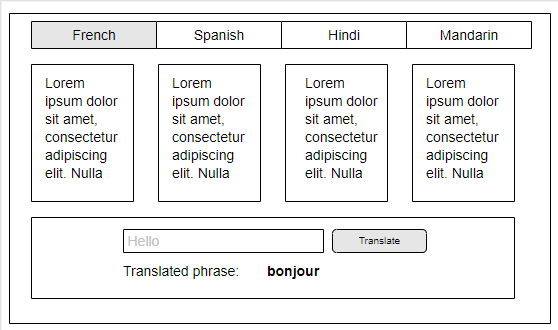

# Language Learning Dashboard

## Welcome to Lingo Language Learning Platform
You and your teammates have been hired to help us build the next DuoLingo, except without the terrifying owl mascot. Your first task is to build a dashboard that users will see as soon as they log in to their account. The dashboard should have a brief introduction to all of the languages that you _could_ learn on our platform. It will also have a limited translator for each language so users can test it out to see if they want to learn it.

## Learning Objectives
1. Practice printing to the DOM with JavaScript
1. Practice using single responsibility functions
1. Practice writing loops and conditionals
1. Practice click events and selecting user inputs

## MVP Definition (Minimum Viable Product)
1. When a user clicks on a link in the nav bar, they should see that language's information displayed on the web page.
    - All of the information you need to display is stored in objects in your individual language JavaScript files
2. Users should see a section at the bottom of each page for a translator. The section should have an text input and a button that says "Translate".
3. When the user enters a phrase and clicks the "Translate" button, they should see either the translated phrase from the appropriate language's dictionary or, if the entered phrase is not in the dictionary, a helpful error message.
4. Language information should be displayed in a two, three, or four column layout. You can decide how many columns you want to use as a team. Your layout should be consistent across all pages. We've installed Bootstrap for you-- [you're welcome to use their grid system to help with your layout](https://getbootstrap.com/docs/4.0/layout/grid/), or you can make your own.

## Instructions
1. Each team member should choose a language.
1. Use the language data in your JavaScript file. Your job is to print it to the DOM when the user clicks on the appropriate link in the nav bar. For example, when the user clicks on "Hindi" in the nav bar, _only_ the information about the Hindi language should print to the DOM. If the user then clicks on "French" in the nav bar, the DOM component representing Hindi should disappear and be replaced by the DOM component representing French.
1. As a team, decide what layout, basic styles and class names you want to use.
1. You have a file called `domPrinter.js`. You should use this file to _define_, but not execute, single responsibility functions that build and return individual DOM components. As a team, you should attempt to evenly share the task of writing these DOM printer functions.
    - Before you start writing printer functions, discuss what HTML elements you're going to need and divy up the work accordingly. For example, if almost everyone is going to need to use paragraph elements in their language page, only one person needs to write the function that returns a paragraph element and everyone else can use it.
    - You should _execute_ these functions in your individual language files to print your language data to the DOM.

## Stretch Goals
#### Add sound to your translator
1. Add a "Play" button to your translator. When the user clicks the "Play" button, they should hear the translated phrase with the appropriate accent.
    - Use the [Speech Synthesis API](https://flaviocopes.com/speech-synthesis-api/) that's built into your browser.

#### Translation API
1. Instead of using the dictionary objects in your JavaScript files, use [this free translation API](https://tech.yandex.com/translate/) to translate any word or phrase into your given language. You'll need to use the the syntax from [this chapter](https://github.com/NewForce-at-Mountwest/client-side-mastery/blob/master/book-2-the-neophyte/chapters/FETCH_INTRO.md) to pull data from the API and display it to the DOM.
